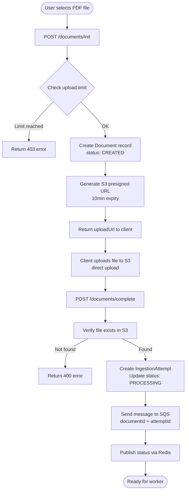
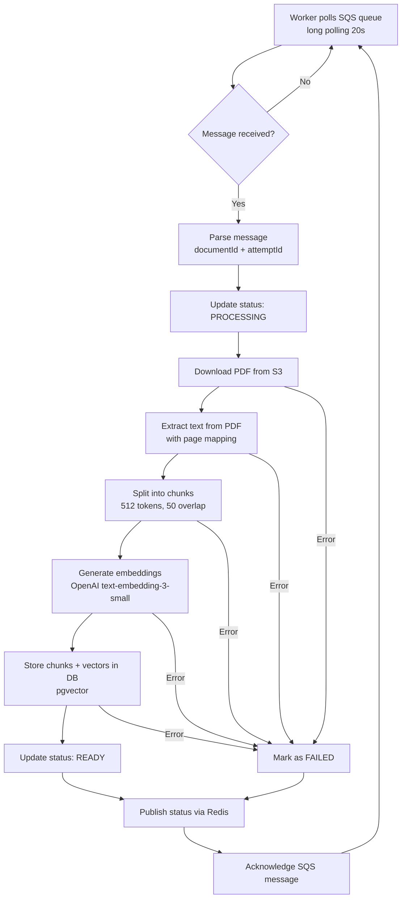
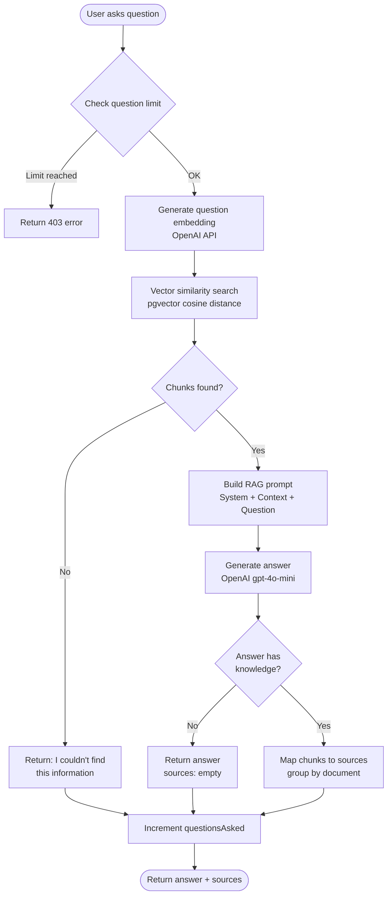

# Larry System Workflows

This document describes the three main workflows in the Larry RAG chatbot system: document upload, worker processing, and chat/query.

## 1. Document Upload Flow

User uploads a PDF file → Stored in S3 → Enqueued for processing in SQS

## 2. Worker Processing Flow

Worker polls SQS → Extracts text from PDF → Generates embeddings → Stores in database

## 3. Chat/Query Flow

User asks question → Vector search finds relevant chunks → RAG prompt → LLM generates answer with sources

## Technical Notes

- **Vector search**: Uses PostgreSQL pgvector extension with cosine similarity
- **Embeddings**: OpenAI text-embedding-3-small model (1536 dimensions)
- **Chunking**: 512 tokens target size, 50 tokens overlap between chunks
- **Real-time updates**: Redis pub/sub for document status updates to the web client
- **Queue**: AWS SQS with long polling (20 seconds) for reliable async processing
- **Storage**: AWS S3 for PDF files, presigned URLs for secure direct uploads
- **Database**: PostgreSQL with pgvector extension for vector similarity search
